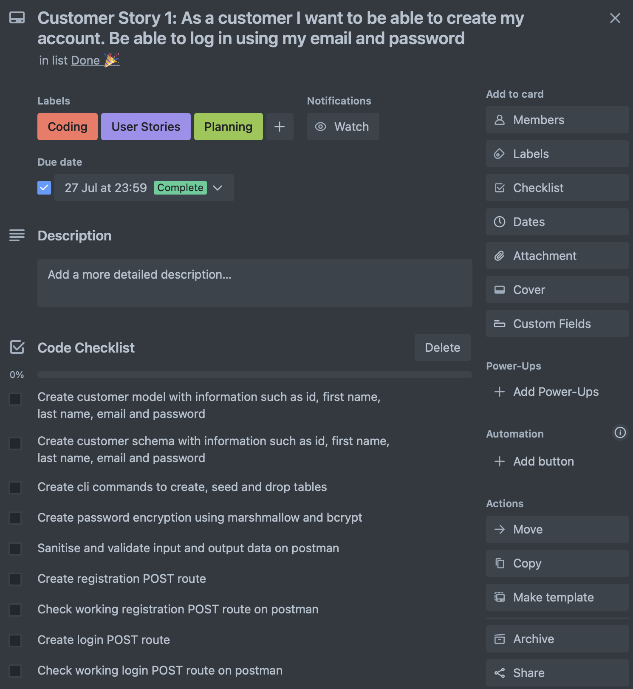

# Pet Stays Web Server API Documentation

## [Trello Board](https://trello.com/b/NPLfb6PC/kanban-template)

## [ERD](https://app.diagrams.net/#G1I-4U3wv1i2_V0kGVO5lwG6Q1FaRff3eB)

## Table of Contents

- [Pet Stays Web Server API Documentation](#pet-hotel-web-server-api-documentation)
- [R1 and R2 Problem Identification and Justification]()
- [R3 Justification of the Database System]()
  - [Relational Database Management System (RDBMS)]()
  - [PostgreSQL Database Management]()
- [R4 Functionalities and Benefits of an ORM]()
- [R5 API Endpoints]()
- [R7 Third Party Services]()
  - [SQLAlchemy]()
  - [Psycopg2]()
  - [Flask-Marshmallow]()
  - [Python-Dotenv]()
  - [Flask-Bcrypt]()
  - [Flask-JWT-Extended]()
- [R8 Description of Models Relationship]()
- [R6 & R9 ERD & Database Relations Implementation]()
- [R10 Project Planning and Tracking Tasks]() 
- [Reference List](#reference-list)

## R1 and R2 Problem Identification and Justification

The problem being solved by this application is the need for a secure method pet owners can create personal accounts with a pet sitter company to store personal information about customers and their pets respectively.
This serves as a secure communication platform for pet sitters to inform customers regarding their loved ones while being away from them, organise drop offs and pick ups with the pet sitters, segragating and organising communications from the normal messaging applications they may already utilise. An account system serves to separate pet matters from personal ones as pet sitters serves as a location to directly update contact details for the customer's conveniences.

Future iterations of this application will allow customers to send messages to pet sitters and enable the communication services to be a two-way direction service instead of just a one-way service. Staff can also access personal information about the pets in order to provide better personalised care for each of the pet's individual needs.

## R3 Justification of the Database System

There are many database management systems available, each with their own advantages and disadvantages and suitable for different situations and conditions. To ensure the most appropriate type of database management system was used for this application, an analysis was done to study all the different alternative database system options currently available to utilise.

__Relational Database Management System (RDBMS)__

A Relational Database Management System (RDBMS) was chosen for this application to clearly define different tables (entities) and establish relationship between these entities (Microsoft, 2022). The ability for data to be organised in a structured manner and allow users to rapidly request complex queries with ease are the many advantages of using RDBMS (Dolphin, 2022). 
RDBMS enables a clear structure of tables for the pet_sitting_db and the distinct relations illustrated between each created entity (Customer, Pet, Pet Sitters and Messages delivered by Pet Sitters). 

The disadvantages of an RDBMS is that it does not provide the flexibility that non-relational databases have to offer, however data stored in the application shows stable and consistent attributes and data integrity is shown solidly through the schemas created. As the database structure for this application will be less likely to change upon creation, this disadvantage will not be of concern over the course of time (Dolphin, 2022). 

Another drawback to RDBMS is the objects in the programming language must be converted from one form to another when used in code. However, this can be easily overcome by utilising an object relational mapper.

Alternatives such as NoSQL offer better at scalling horizontally and partition tolerances, however at the cost of consistency and referential integrity of tables, which are crucial for this application (Hero Data Inc, 2022). Hence, PostgreSQL is still the most appropriate management system to use for this application.

__Advantages of RDBMS__

- Widely implemented and proven working database management system

- Compared to other non-relational databases is more structured

- Easy to use

- Users can readily retrieve information using SQL queries, which are more efficient in relational databases compared to other systems. In contrast to NoSQL databases, which are alternatives to relational databases, often lack support for complex joins, sub-queries, and nesting of queries within WHERE clauses.

- Entity integrity is maintained by ensuring that each row in the database possesses a unique attribute, known as a primary key. This ensures that each row represents a distinct instance of the entity, preventing data duplication and anomalies.

- Referential integrity is ensured using foreign keys, which prevents insert anomalies by accepting only values that exist in related tables. To avoid update or delete anomalies, rows containing a primary key used as a foreign key in another table cannot be deleted by default.

- The database is ACID (Atomicity, Consistency, Isolation, Durability) compliant, ensuring efficient and reliable transactions, making it an excellent choice for online transaction processing.

- Domain integrity is easily achieved in a relational database by defining the acceptable data type for each column and applying data validation rules and constraints. Normalization also contributes to achieving domain integrity by enforcing uniqueness, consistent data types, non-transitive dependency on the primary key, and atomicity for each attribute.

__Disadvantages of RDBMS__

- Relational databases like SQL have a more rigid and predefined structure, which limits their flexibility compared to non-relational databases like NoSQL. NoSQL stores data in unstructured or semi-structured formats, often using key-value pairs or JSON documents. This flexibility makes NoSQL a better fit for data with frequently changing structures and more adaptable to changes. NoSQL databases also excel in high-volume services, offering sub-second response times.

- When using relational databases, objects in programming languages like Python need to be converted to and from the database storage format. In contrast, many non-relational databases, such as MongoDB, allow direct mapping of documents to data structures in popular programming languages, eliminating the need for conversion.

- The use of tables with rows and columns in a relational database consumes a considerable amount of physical memory.

- Compared to NoSQL databases, relational databases offer less partition tolerance. RDMS typically scale vertically by adding more resources to a single server, while NoSQL databases scale horizontally, allowing the addition of more servers or nodes as needed to handle increased loads. Horizontal scaling in NoSQL is faster and more cost-effective than vertical scaling. Additionally, NoSQL databases can partition and replicate data across different machines or nodes, providing redundancy and fault tolerance.

__PostgreSQL Database Management__

PostgreSQL was chosen for the database system of this application for it's stability and powerful, enterprise class, object-relational database system commonly utilized as a back-end database for many available web applications. 
It offers numerous advantages that align well with the requirements of this application (see table below).
One of the key deciding factors to utilise this database system is that it is free to use and is open sourced, making it cost-effective and suitable for the pet sitting company that aims to flourish its business by minimising cost where possible and allocate expenses to other required resources. 
PostgreSQL also has a long development history of 30 years and is already known for its reliability, robustness, extensibility, and data integrity (The PostgreSQL Global Development Group, 2022).

PostgreSQL is popular amongst professional developers with reports in 2021 of 44% users utilising this Database Management system (StackOverflow, 2021). It's popularity ensures it is consistently maintained, has complete documentation, a strong community of support behind it leading to contionous cycle of performance improvements and innovative solutions. This ensures that any problems encountered with the creation of a database system has a solution to it through previous user experiences. 

PostgreSQL's capabilities are more than sufficient for this application, as it can manage vast amounts of data and process a high number of queries per second. Its multi-version concurrency control also allows multiple users like staff and customers to access the database at the same time without crashing between various query searches. 

Although PostgreSQL's speed and performance might not match up to competitors like MySQL, this is not a critical concern for this application. Other factors like cost, reliability, robustness, and data integrity take precedence. 
While PostgreSQL's documentation is mainly available in English, it should not significantly impact this application's staff and customers.

The installation and configuration processes may be slightly more complex compared to MySQL and other systems. However, these processes are well-documented and solveable in a short term (Ionos, 2022) (Peterson, 2022).

__Advantages__

- PostgreSQL is a freely available and open-source database system that offers users the flexibility to customize and expand its functionalities, including the addition of new data types, functions, operators, indexing methods, and procedural languages.

- PostgreSQL has earned a strong reputation for its reliability, robustness, extensibility, and data integrity. It is compatible with major operating systems like Linux, Windows, MacOS, and more.

- The database's popularity is evident from its extensive usage by 44% of professional developers in 2021, with a continuous growth trend. Prominent companies such as Apple, Netflix, Reddit, Instagram, and Spotify rely on PostgreSQL.

- PostgreSQL is well-maintained, thoroughly documented, and backed by an active community, ensuring consistent performance and innovative solutions.

- Scalability is one of its strong points, as it efficiently handles large databases, managing thousands of terabytes of data and processing 100 thousand queries per second. Its multi-version concurrency control allows simultaneous database access.

- The database excels in handling complex queries, including intricate writes with concurrent data usage that require validation.

- ACID (Atomicity, Consistency, Isolation, Durability) compliance ensures efficient and reliable database transactions, making PostgreSQL an ideal choice for processing online transactions.

- Its versatility is highlighted by easy integration with a wide range of programming languages, frameworks, and other systems, supporting .Net, C, C+, Delphi, Java, JavaScript (Node.js), PHP, Python, Perl, Ruby, and Tcl.

- PostgreSQL supports both SQL for relational querying and JSON for non-relational querying, making it adaptable to various data requirements.

- The database is also compatible with multiple data types, including those for geographical data, as well as support for image, video, and audio storage.

- Widely used in different industries, PostgreSQL serves as a favored back-end database for web applications, dynamic websites, and finds applications in the financial sector, geographic information systems, and manufacturing.

__Disadvantages__

- PostgreSQL supports fewer open-source applications compared to MySQL.

- Data replication in PostgreSQL can be intricate.

- Making speed improvements in PostgreSQL requires more effort than in MySQL, as PostgreSQL prioritizes compatibility.

- PostgreSQL's speed and performance is not as good as its competitors.

- PostgreSQL's installation and configuration process can be more complex than other systems.

- PostgreSQL's lack of a single company ownership can limit its marketing and awareness efforts.

## R4 Functionalities and Benefits of an ORM

An Object Relational Mapper (ORM) acts as an intermediary between object-oriented programming (OOP) and relational databases, eliminating the need to directly write SQL queries. SQL is the standard language for working with databases, and an ORM simplifies the conversion of data between the program's storage format (e.g., Python objects) and the relational structure of the database (tables with rows and columns). As a result, developers can interact with the database using their preferred programming language instead of dealing with SQL directly.

In this particular application, SQLAlchemy serves as the chosen ORM, a widely respected database toolkit and ORM designed for Python. SQLAlchemy provides a flexible interface for creating and executing database-agnostic code, freeing developers from relying solely on SQL statements.

ORMs generate virtual objects that mirror the database tables, and in this application, a model has been established for each entity in the database, providing an abstract representation of the corresponding table. Each class attribute in the model corresponds to a field (column) in the table. Additionally, ORMs monitor object changes and synchronize these modifications back to the database by generating SQL code for database operations like insert, update, create, and delete, based on the application's interactions with the model (Liang, 2021).

The primary advantage of using an ORM is that developers can create database queries using Python code by invoking methods on a class, which the ORM then translates to SQL and executes, offering protection against potential malicious data (Liang, 2021).

Another notable feature of SQLAlchemy is its ability to map relationships between classes to relationships between database tables using foreign key constructs. The ORM supports four types of relationships: One To Many, Many To One, One To One, and Many To Many. Furthermore, ORM allows the definition of cascade behavior when establishing relationships, allowing operations on parent objects to also affect child objects, depending on the chosen behavior.

Sessions play a crucial role in SQLAlchemy as well, ensuring consistency by acting as a "holding zone" for all interactions with the database. Any ORM objects affected by a transaction are kept inside the session and will be committed to the underlying database together or not at all.

Although ORMs abstract much of the complexity of database interactions, understanding SQL remains important, as certain situations may require direct SQL querying for development, debugging, or performance optimization. In some cases, complex queries may not be efficiently handled by ORMs and may necessitate the use of embedded SQL.

Alternatively, developers have the option of writing raw SQL code to directly interface with the database, offering more fine-grained control and flexibility, but this approach demands in-depth database knowledge and SQL coding skills. However, this manual approach is more time-consuming and lacks many of the advantages provided by an ORM.

The benefits of using an ORM include improved security through data sanitization, enhancing data integrity and guarding against SQL injection attacks. ORMs also result in cleaner and less code compared to embedded SQL, leading to faster development and reduced costs. They facilitate tracking database changes, making debugging and future application modifications more straightforward. Additionally, ORMs offer high-level implementations with excellent support for various tasks, such as transactions, connections, migrations, and more.

In terms of maintainability and code reuse, ORMs encourage developers to think in terms of objects, promoting well-organized and manageable code instead of fragmented data pieces. Furthermore, ORMs abstract the database system, making it easier to switch to a different database platform, which can be advantageous for on-premises solutions or if the API is to be used with various databases (Abba, 2022) (Hoyos, 2018) (Liang, 2021).

## R5 API Endpoints

1. Staff Registration - POST Request
This route is to register new staff members into the system. 
The route requires a first name, last name, email, password, admin and staff information of the new staff member. Admin and staff information required to be given as either True or False to determine whether they are admins or not and to differentiate between customers, admins and staff members.

2. Customer Registration - POST Request
This route allows customers to register into their new accounts. 
It also requires a first name, last name, email and password information to store information of new customers.

3. Staff Login - POST Request
With provided information upon registration, staff can provide email and password previously noted to login into their accounts.

4. Admin Login - POST Request
With provided information upon registration, staff can provide email and password previously noted to login into their accounts.

5. Customer Login - POST Request
With the provided information upon registration, customers can enter in email and password credentials to log into their accounts. 

6. List all customer accounts in system - GET Request

This get request requires admin jwt_token to obtain all customer information. 
If a staff / customer token is provided, it will throw an error like the following:

7. Show individual customer information - GET Request
This route allows customers to view their account information and is unique to corresponding customers and all staff access. Hence, only the jwt_token of the customer with corresponding customer id and staff will be able to access this information.
.

8. Update customer information - Put/Patch Request
This route allows customers to edit and update their information and is unique to corresponding customers and all staff access. Hence, only the jwt_token of the customer with corresponding customer id and staff will be able to access this information. Information needed to be updated can vary from first name, last name, email and password. To update the information, the correct corresponding customer id number needs to be provided in the url. 

9. Delete customer information - DEL Request
This route only allows admins to delete customer accounts and only their jwt_token can procede to the deletion of accounts. 
The information required to be given is the customer id number in the url. 
Error handling for the following routes are as follows:

10. Create Pet Information - POST Request
This route allows customers to create pet information and see them listed in their account. The information required is the name, drop_off_time, pick_up_date and the corresponding customer_id and pet_sitter_id who has created the information. It also requires the jwt_token of the customer in order for the action to be executed.

11. View All Customer Pet Information - GET Request
Only admins are allowed to view all registered pets on the system. The requirement to perform this request is the jwt_token from admin. 

12. View Pet Information from 1 customer - GET Request
Only customers who have registered their pets under their account are able to view their pet's information. The required parameters for this request is their jwt_token. The id on the dynamic router must also be adjusted to match the id number of the customer to gain access to the information. 

13. Delete Pet Information - DEL Request
Only admins are allowed to delete the pet information registered on a customer account, so their jwt_token is required for the request to proceed along with the matching customer id number and pet id number to be deleted.

14. Create Message to Customer - POST Request
This route allows staff to create messages to customers informing them about the pick up and drop off information of pets. The information required is the title, date, content, customer_id and pet_sitter_id this message relates to. 

15. Get All Messages - GET Request
This route allows for staff and admin to retrieve all messages sent to customers. The information required is their jwt token to authorise this request.

16. Get Specific Customer Messages - GET Request
This route allows customers to see specific messages sent by pet sitters using their own jwt token. 

17. Delete Customer Messages - DEL Request
This route allows admins to delete messages. The admin's jwt token is required and the corresponding customer id along with the message id needs to match the message to be deleted in order for a successful operation.

## R7 Third Party Services

The RESTful API for this project was constructed using Flask, a web application framework. Flask offers essential routing capabilities, handling requests, responses, and includes a development server. To create a fast, efficient, and scalable API, Flask leverages various high-level components that collaborate seamlessly together. Being a micro framework, Flask allows the addition of extra functionality through various packages. One of its notable features is agnosticism, which allows developers to replace major components of the framework with alternatives to suit their projects, thus providing flexibility and the freedom to design the server according to their preferences (Pallets, 2010). The development of this API also involved the use of several third-party PyPi packages. For a comprehensive list of dependencies and requirements, please refer to Requirements.txt.

__SQLAlchemy__

The Object-Relational Mapping (ORM) tool utilised for this application is SQLAlchemy. SQLAlchemy is a popular and reputable Python library that facilitates the connection to PostgreSQL. By using SQLAlchemy, the application can interact with the database without writing explicit SQL queries or handling data type conversions. Instead, queries are formulated in Python by invoking methods on a class, and the ORM takes care of sanitizing the input data. It further translates the Python-based query into SQL and retrieves the results as objects. This abstraction simplifies data manipulation and enhances the efficiency of working with the database (SQLAlchemy, 2022).

__Psycopg2__

In this project, Psycopg2 served as the bridge connecting the PostgreSQL database with the Flask application. While SQLAlchemy is compatible with various databases, it relies on an additional package, specific to the type of database being used, to facilitate interactions. This package acts as a driver or adaptor, enabling SQLAlchemy to communicate effectively with the chosen database (SQLAlchemy, 2022).

__Flask-Marshmallow__

Marshmallow schemas were utilized to facilitate the conversion of intricate data types, like objects, to and from Python's native data types. These schemas served multiple purposes, including: validating input data to ensure it meets the required criteria, deserializing input data into application-level objects for further processing, serializing application-level objects into primitive Python types. These serialized objects can be rendered into JSON format for use in the HTTP API (Pallets, 2010).

__Python-Dotenv__

The application employs Python-Dotenv to establish environment variables specified in the ".env" and ".flaskenv" files. 
The ".flaskenv" file contains essential details for project execution, such as the application's running location, port number, and debug mode setting. On the other hand, the ".env" file is utilized to store sensitive configuration information, including the database connection stream containing passwords and the JWT secret key (Pallets, 2010). This approach enhances security compared to hard-coding such sensitive information directly into the application.

__Flask-Bcrypt__

Flask bcrypt is a Flask extension utilized to safeguard passwords through bcrypt hashing, which relies on the Blowfish cipher. This process involves converting a string of varying lengths of characters into a fixed-length. The hashing function consistently generates the same output for a given input, and even a minor alteration in the input string will substantially alter the resulting hash. To further enhance security, the extension incorporates a "salt" code which protects account logins against potential rainbow table attacks. A rainbow table contains precomputed hash values that could be exploited to discover commonly used passwords (illustrated in figure 1 below). To counter this vulnerability in password creations, a random "salt" value is added to the original message before hashing it (Okta, 2022). Additionally, the bcrypt hashing functions can intentionally slow down brute force attacks.

__Flask-JWT-Extended__

The API incorporates the JWT Extended library to enable JSON Web Tokens (JWT) authentication. With JWT, the server verifies the user's credentials and responds by providing an encrypted token to the client. This token is ideally stored in session storage and added as an authorization header for subsequent requests. This implementation is crucial to safeguard personal information from unauthorized access. JWT is a suitable choice due to its open standard, self-contained nature, compactness, security, and scalability (Okta, 2022). The use of a secret key in the digital signature ensures that information can be verified and trusted, thereby confirming the identity of the person accessing the information (Andress, 2019). Each user's identity can be accessed via the JWT token, allowing the application to serve resources to specific users.

Additionally, JWT helps eliminate the need for users to log in for each request. Functions such as create_access_token() enable the creation of JSON Web Tokens, jwt_required() protect routes, and get_jwt_identity() retrieve the identity of a JWT in a protected route. This simplifies and streamlines the authentication process within the API.

## R8 Description of Models Relationship

The ERD of the following application indicates two main tables present: these are the Customer and Pet Sitter (Staff) tables. These tables are connected through two many to many relationships with Pet table and Messages table. From the Customer's table perspective, one customer can have at least one or many pets registered in the application but one pet has to be related to 1 customer. Same with messages, a customer can have many messages associated to them but one message has to trace back to one customer. 
From the Pet Sitter's table, we can see a similar situation where one pet sitter can be in charge of at least one pet, but one pet has to be related to one pet sitter. One pet sitter can send one or many messages relating to 1 customer or many customers, but one message has to be created by one pet sitter.  

The corresponding foreign keys for the Message and Pet tables are the customer ids and the pet sitter ids. This allows them to be related to the Customer and Pet Sitter tables interchangeably.  

## R6 & R9 ERD & Database Relations Implementation

The model for the Pet Sitter table is illustrated below:

The implementation thinking for this table was to include all the required information of staff, such as first name, last name, email, password, label staff as True and the admin attribute was either determined as True or False as not every staff can be an admin. 

A relationship was also established between the Pet and Message tables in the coding of the database. The cascade all delete attribute triggers the deletion of all related records of Pet and Message within the Pet sitter and Customer table. If staff records or customer records were also deleted from the system, all related pet and message records would also be deleted from the system. 

The model for the Customer table is illustrated below:

The customer table initially requires the attributes first name, last name, email, password and upon registration of the customer, pet details can also be outlined and related back to customer tables. Messages created by staff can also be associated with the customers through the use of the foreign key attributes linked to this table. 

The model for the Pet table is illustrated below:

Upon creation of pet details, the name, drop off, pick up details are requirements of this and also the relation associated with pets, such as the owner / customer id the pet is related to. The staff id also needs to be created upon the creation of the pet details in the route. This allows for easier identification of the pet owner and staff who takes care of the pet. 

The foreign keys associated with the pets are also coded in, which are the customer and pet sitter ids. Upon deletion of the customer information, pet details will also be deleted as the cascade all delete attribute is in operation. 

The model for the Message table is illustrated below:

The messages contain title, content and the date information which are required details to be filled for the creation of messages to be successful. The associated customer and pet sitter ids are also determined in the message creation to easily relate the message to customers and pet sitters. 

The foreign keys associated with the messages are also coded in, which are the customer and pet sitter ids. Upon deletion of the customer information, message details will also be deleted as the cascade all delete attribute has been determined in the coding

## R10 Project Planning and Tracking Tasks

### Creating a Trello Board

Trello was used to keep track of the development process of this project. The trello board was divided into 5 categories:

1. Backlog - A list of tasks I would like to do for the project. This was where the brainstorming of the project ideas were listed, elaborated and prioritised by importance. All the specifications of the project was thought through and listed down, even if it was not implemented in the project. I was aware of the time restrictions and the labour restrictions of the project, hence wanted to list down all of the tasks to pick which ones to prioritise on. In the future, I would like to add an additional feature where the users can also send messages to the reply to Staff messages and allow users to create ratings on Staff performance while caring for their pets. 
2. To-Do - A list of prioritised planned work to be completed
3. Doing - Tasks that are currently being worked on. I was able to focus on what needs to be done for the day by listing the tasks in this section and store ongoing tasks as a daily reminder to tick off, such as keeping an ongoing list of references. 
4. Testing - Completed tasks that are yet to be tested/reviewed
5. Done - Completed Tasks

I began the project by creating the Trello board for this project using the Kanban template available in the set templates list. 

 
### User Story Utilisation

After creating the preliminary tasks, this helped me determine the key tasks required to create the application. Each short explanation outlined a specific user need outlining what each role was, what action needed to be performed and why. Following the agile methodology, they were expressed through user perspective and were used to help establish tasks to be completed (Atlassian, unknown). These user stories informed me as a developer of what data and information needs to be stored in the database, the routes/end points required to be made (Agile Alliance, 2022). This ensures the application delivered the highest value to the end user by ensuring the core needs were met and end users were kept in mind as a priority (Atlassian, unknown).  

In future projects, I would write this before writing the problem documentation and creating an ERD for the project, as this would have allowed me to better map the ERD and normalised the data information before beginning the coding.

### Prioritisation, Timeframes and Labels

After writing user stories, I wrote a checklist of tasks to be completed for each user story. Every checklist was ensured the tasks were specific, achieveable and actionable by my current programming capabilities. I assigned dates to the tasks to be done, prioritised each task and assigned labels to keep track of the categories these tasks fall into, also to bookmark each task, such as either categorising them as a README, coding, planning or userstory task. 

### Addition of Marked Elements

I also added tasks to be completed that needed to meet assesment requirements and marks outlined in the assignment rubric. This allowed me to mark tasks as complete as I progressed through the assignment and know which outstanding tasks are needed to complete before the deadline. 

### References

Agile Alliance. (2022). Agile 101 What is Agile? Retrieved 12 July, 2023, from https://www.agilealliance.org/agile101/

Atlassian. (n.d.). User stories in agile project management. Retrieved from https://www.atlassian.com/agile/project-management/user-stories

Andress, J. (2019). Foundations of Information Security: A Straightforward Introduction. San Fransisco : No Starch Press.

Dolphin, R. (2022, Feb 23). SQL vs NoSQL | Comparing Relational and Non-Relational Database Management. Retrieved 13 July 2023, from Towards Data Science: https://towardsdatascience.com/comparing-relational-and-non-relational-database-management-systems-sql-vs-nosql-f4c8f5988365

Hevo Data Inc. (2022, May 6). Relational Database Vs NoSQL: 7 Critical Aspects. Retrieved 13 July 2023, from Hevo Data: https://hevodata.com/learn/relational-database-vs-nosql/

Ionos. (2022, September 22). PostgreSQL: a closer look at the object-relational database management system. Retrieved July 16, 2023, from Ionos: https://www.ionos.com/digitalguide/server/know-how/postgresql/

Liang, M. (2021, March 11). Understanding Object-Relational Mapping: Pros, Cons, and Types. Retrieved 29 July 2023, from Altexsoft: https://www.altexsoft.com/blog/object-relational-mapping/

Microsoft. (2022, July 4). Relational vs. NoSQL data. Retrieved 15 July 2023, from https://learn.microsoft.com/en-us/dotnet/architecture/cloud-native/relational-vs-nosql-data

Okta. (2022). Introduction to JSON Web Tokens. Retrieved 16 July, 2023, from https://jwt.io/

Pallets. (2010). Flask Web development one drop at a time. Retrieved 15 July, 2023, from Flask’s Documentation: https://flask.palletsprojects.com/en/2.2.x/ Peterson, R. (2022, October 15). What is PostgreSQL? Introduction, Advantages & Disadvantages. Retrieved October 20, 2022, from Guru99: https://www.guru99.com/introduction-postgresql.html

PostgreSQL Tutorial Website. (2022). Retrieved 18 July, 2023, from What is PostgreSQL?: https://www.postgresqltutorial.com/postgresql-getting-started/what-is-postgresql/

Real Python. (2014). Model-View-Controller (MVC) Explained – With Legos. Retrieved 18 July 2023, from https://realpython.com/ the-model-view-controller-mvc-paradigm-summarized-with-legos/

Shields, W. (2019). SQL QuickStart Guide: The Simplified Beginner's Guide to Managing, Analyzing, and Manipulating Data With SQL. ClydeBank Media LLC. SQLAlchemy. (2022). SQLAlchemy 1.4 Documentation. Retrieved 16 July 2022, from https://docs.sqlalchemy.org/en/14/

StackOverflow. (2021, June). 2021 Developer Survey. Retrieved  on 14 July 2023 Stack Overflow: https://insights.stackoverflow.com/survey/2021#most-popular-technologies-platform

The PostgreSQL Global Development Group. (2022). PostgreSQL: The World's Most Advanced Open Source Relational Database. Retrieved October 2, 2022, from https://www.postgresql.org/